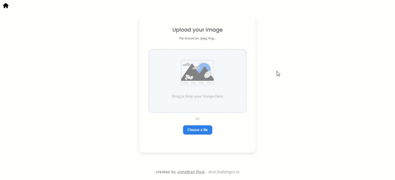

<h1 align="center"><a href="https://image-uploader-devchallenges-io.vercel.app">Image Uploader</a></h1>

## _Overview_

<details>
  <summary>Click to view!</summary>
  
</details>

## _Built With_

- [React](https://reactjs.org/)
- [Redux](https://redux.js.org/)
- [Node](https://nodejs.org/es/)
- [Express](https://expressjs.com/)
- [PostgreSQL](https://www.postgresql.org/)
- [Sequelize](https://sequelize.org/)

## _How To Use_

```bash
# Clone this repository
$ git clone https://github.com/jruizsilva/image-uploader-devchallenges.io

# Install dependencies
$ npm install

# Run the app
$ npm start
```

## _Contact_

- Website [jruizsilva.netlify.app](https://jruizsilva.netlify.app/)
- GitHub [@jruizsilva](https://github.com/jruizsilva)
- Linkedin [@jruizsilva](https://www.linkedin.com/in/jruizsilva/)
